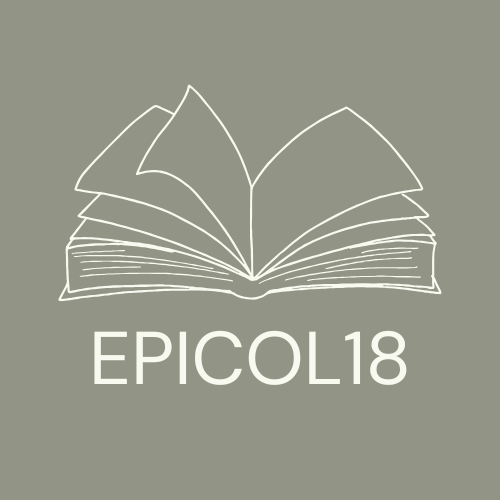

# EPICOL18 - An interactive corpus-interface to an 18th century epistolary novels corpus

    

## Start page

## Top words and Parts-of-Speech

## Word Frequency and Visualization

## Find N-Grams of sizes 2,3,4,5

## Show Key Words in Context (KWIC)

## Diachronic Frequency Visualization

